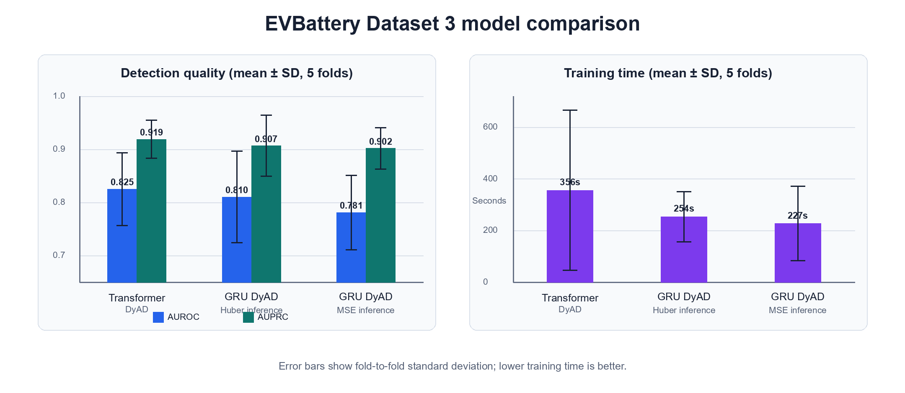

# EV Battery Anomaly Detection

This project modifies the EVBattery DyAD anomaly detector and finds that a Transformer reaches the highest mean AUROC on Dataset 3, while a GRU with Huber-based inference comes close with lower training time.

## Research question

On the smallest EVBattery manufacturer dataset, do Transformer sequence layers or a more robust reconstruction-loss choice improve vehicle-level battery anomaly detection enough to justify their computational cost?

## Approach

The notebook adapts the DyAD model from *EVBattery: A Large-Scale Electric Vehicle Dataset for Battery Health and Capacity Estimation*. Only Dataset 3 is used because of compute constraints. It contains 49 vehicles, including 16 labeled anomalous vehicles, and 176,327 charging snippets.

Three variants are evaluated with five folds:

1. Transformer encoder/decoder DyAD.
2. GRU DyAD scored with Huber reconstruction loss at inference.
3. GRU DyAD scored with mean squared reconstruction loss at inference.

Training uses up to 75 epochs with early stopping. This is also why the notebook's implementation of the original GRU DyAD network differs from the paper's result: it gives the network a larger epoch budget and stops at the best observed checkpoint instead of following the original training schedule. Results are vehicle-level anomaly metrics reported as mean ± standard deviation across the five folds.

## Results

| Model | AUROC ↑ | AUPRC ↑ | F1 ↑ | Training time ↓ | Test time |
|---|---:|---:|---:|---:|---:|
| Transformer DyAD | **0.8250 ± 0.0687** | **0.9189 ± 0.0356** | 0.8972 ± 0.0184 | 355.5 ± 309.8 s | **14.2 ± 0.7 s** |
| GRU DyAD — Huber inference | 0.8104 ± 0.0863 | 0.9066 ± 0.0576 | **0.8999 ± 0.0302** | 253.9 ± 97.0 s | 18.1 ± 0.9 s |
| GRU DyAD — MSE inference | 0.7810 ± 0.0699 | 0.9017 ± 0.0389 | 0.8949 ± 0.0392 | **227.0 ± 144.0 s** | 18.1 ± 1.0 s |

The original paper reports Dataset 3 DyAD AUROC of **0.698 ± 0.128**. The notebook's closest comparison—the GRU DyAD with MSE inference—reaches **0.7810 ± 0.0699** after the larger epoch budget and early stopping are added. It should therefore be read as an improved-training rerun, not an exact reproduction of the paper's baseline. Full per-fold results, thresholds, recall, precision, runtime, and memory use are recorded in [`EV Batteries full metrics.md`](./EV%20Batteries%20full%20metrics.md).

## Interpretation

The Transformer has the best mean AUROC and AUPRC, but its mean AUROC advantage over the Huber-scored GRU is only 0.0146 while its mean training time is about 40% higher. For this compute-limited experiment, Huber inference offers the more attractive performance-cost trade-off.

The comparison does not establish that Transformers are ineffective for battery anomaly detection. Fold-to-fold variance is substantial, the dataset has only 16 anomalous vehicles, and no paired significance test was run.

## Reproduction

The experiment is contained in [`EV_batteries.ipynb`](./EV_batteries.ipynb) and was developed in Google Colab.

1. Download `battery_dataset3.tar.gz` from the authors' EVBattery data release.
2. Place it at `My Drive/Projects/EV Batteries/Dataset/battery_dataset3.tar.gz`, or change the archive and `FILEPATH` values near the top of the notebook.
3. Open the notebook in Colab with Drive mounted.
4. Run all cells in order. The notebook extracts the archive, builds cached NumPy/parquet files, and trains all five folds for each model variant.

The notebook imports PyTorch, pandas, NumPy, scikit-learn, matplotlib, tqdm, and psutil. A CUDA runtime is strongly recommended for the full rerun.

## Limitations

- Only Dataset 3 was tested; results may not transfer to the other manufacturers or the combined dataset.
- Dataset 3 has 49 vehicles and only 16 anomaly labels, so each fold is small.
- Training time has high fold-to-fold variance and depends on Colab hardware.
- Means and standard deviations over five folds are descriptive; no statistical test compares the model variants.
- The original-paper baseline and this notebook's reruns use different training schedules because the reruns add more epochs and early stopping.

## Attribution

Based on the data, code, and DyAD method from:

> Haowei He et al. (2022), [*EVBattery: A Large-Scale Electric Vehicle Dataset for Battery Health and Capacity Estimation*](https://arxiv.org/abs/2201.12358).

The original data and code are released by the authors under CC BY-NC-SA; follow the license and access terms in their release.
